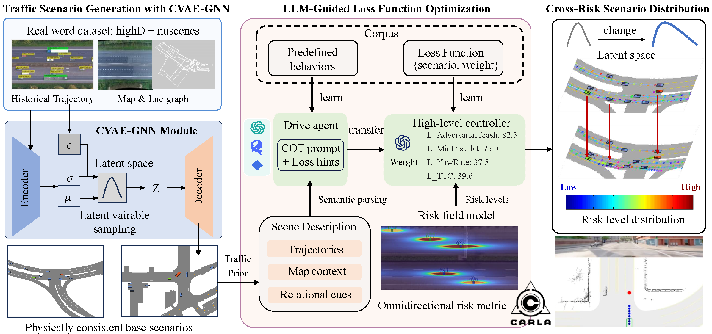

<div align="center">

# Learning from Risk: LLM-Guided Generation of Safety-Critical Scenarios with Prior Knowledge

[](https://arxiv.org/abs/2511.20726)
[](https://yourname.github.io/project-page/)
[](https://opensource.org/licenses/MIT)

<!-- Authors -->
<br>

**Yuhang Wang**<sup>1</sup>, 
**Heye Huang**<sup>2,3*</sup>, 
**Zhenhua Xu**<sup>4</sup>, <br>
**Kailai Sun**<sup>2,3</sup>, 
**Baoshen Guo**<sup>2,3</sup>, 
**Jinhua Zhao**<sup>2,3</sup>

<br>

<!-- Affiliations -->
*<sup>1</sup>University of Chinese Academy of Sciences, China* <br>
*<sup>2</sup>Singapore-MIT Alliance for Research and Technology Centre (SMART), Singapore* <br>
*<sup>3</sup>Massachusetts Institute of Technology (MIT), USA* <br>
*<sup>4</sup>Tsinghua University, China* <br>

<br>



</div>

## 📖 Abstract

This repository is the official implementation of **"Learning from Risk: LLM-Guided Generation of Safety-Critical Scenarios with Prior Knowledge"**. Built on top of the [STRIVE](https://nv-tlabs.github.io/STRIVE/) (CVPR 2022) traffic prior, we add an **LLM multi-agent pipeline** that:

1. analyses each scene with an `AnalysisAgent` and selects an **attacker vehicle**,
2. quantifies long-tail potential with a deterministic `LongTailAssessor`,
3. uses a `ReflectionAgent` (LLM) to produce **scenario-adaptive loss weights** for the adversarial optimisation.

This README focuses on **end-to-end reproduction** — from environment setup, data preparation, pretrained weights, to training, scenario generation, ablations, and evaluation.

---

## 🏗️ Qualitative Results

<div align="center">

Visualising the generation process across 4 diverse scenarios.
**Left (Initial):** the benign traffic initialisation. **Right (Generated):** the safety-critical scenario produced by our LLM-guided framework.

<table>
  <tr>
    <th width="50%" style="text-align:center"><strong>Initial Scene (Before)</strong></th>
    <th width="50%" style="text-align:center"><strong>Generated Risk Scenario (After)</strong></th>
  </tr>
  <tr>
    <td><video src="https://github.com/user-attachments/assets/812f14f5-d84d-4704-aeaa-62877d35e693"></td>
    <td><video src="https://github.com/user-attachments/assets/239e4c14-bd6e-4867-8402-c6e6f204bd76"></td>
  </tr>
  <tr>
    <td><video src="https://github.com/user-attachments/assets/b6538b6e-c4ea-4da0-801f-892ea5936db5"></td>
    <td><video src="https://github.com/user-attachments/assets/9f40b4d3-6b4f-455c-9012-88a334badb4c"></td>
  </tr>
  <tr>
    <td><video src="https://github.com/user-attachments/assets/83d3cfe1-700d-4308-a607-5fed80eccea2"></td>
    <td><video src="https://github.com/user-attachments/assets/e720a592-7ebe-4e4c-b4ab-8d7ebb14e1a3"></td>
  </tr>
  <tr>
    <td><video src="https://github.com/user-attachments/assets/b5efb473-2461-46c5-958f-e245112f60ea"></td>
    <td><video src="https://github.com/user-attachments/assets/de0ebb30-bef6-45eb-889c-9d77691ae0b0"></td>
  </tr>
</table>

</div>

---

## 🛠️ 1. Environment Setup

Tested on **Ubuntu 18.04 / 20.04**, **Python 3.8**, **PyTorch 1.9.0**, **CUDA 11.1**, single GPU with ≥ 8 GB VRAM.

```bash
# 1) Create and activate a conda env
conda create -n strive python=3.8 -y
conda activate strive
pip install --upgrade pip

# 2) Install numpy first (pinned for nuScenes devkit compatibility)
pip install numpy==1.19.5

# 3) Install the rest. requirements.txt pins exact versions.
#    If your CUDA differs, replace the +cu111 wheels accordingly.
pip install -r requirements.txt
```

> **Important:** keep `nuscenes-devkit==1.1.5` in sync — newer versions break the dataloaders.

The traffic model uses [PyTorch Geometric](https://pytorch-geometric.readthedocs.io/) (`torch-scatter`, `torch-sparse`, `torch-geometric`). The `--find-links` lines in `requirements.txt` already point to the matching wheels for `torch==1.9.0+cu111`.

---

## 📂 2. Data Preparation

### nuScenes (required)

You only need **metadata** and **map expansion** — full sensor data (images / LiDAR) is **NOT** needed.

* Download from [https://www.nuscenes.org/download](https://www.nuscenes.org/download)
* The codebase also supports the `v1.0-mini` split out-of-the-box for smoke tests.

### Provided clustering files

We ship the paper's clustering under `data/clustering/`:

```
data/clustering/
├── cluster.pkl         # collision-pattern clusters
└── cluster_labels.txt  # human-readable labels
```

### Final directory layout

```text
STRIVE/
├── data/
│   ├── nuscenes/
│   │   └── trainval/
│   │       ├── v1.0-trainval/      # metadata JSONs
│   │       └── maps/               # basemap / expansion / prediction / *.png
│   ├── clustering/                 # shipped in this repo
│   └── strive_scenarios/           # (optional) pre-generated scenarios from authors
├── model_ckpt/                     # see §3 — put .pth files here
├── configs/
├── src/
├── longterm/
└── ...
```

---

## 🧊 3. Pretrained Traffic-Model Weights

Pretrained CVAE traffic priors are released by STRIVE on Dropbox. Put them under `model_ckpt/`.

| File | Trained on | Used by |
|---|---|---|
| `traffic_model.pth` | car + truck | `adv_gen_rule_based.cfg`, `adv_gen_replay.cfg`, all ablations |
| `traffic_model_all_cats.pth` | all categories | `adv_gen_replay_cyclist.cfg`, all-cat training/testing |

Download link is given in [`model_ckpt/README.md`](./model_ckpt/README.md).

> Weights and pre-generated scenarios are derived from nuScenes and licensed separately under **CC-BY-NC-SA-4.0**.

---

## 🔑 4. LLM Configuration (only for `use_llm=True`)

The full method depends on an LLM for scenario-adaptive loss weights. Configure **one** provider:

```bash
# Choose one
export DEEPSEEK_API_KEY=sk-xxxx
export OPENAI_API_KEY=sk-xxxx
export ANTHROPIC_API_KEY=sk-ant-xxxx
```

Provider / model details live in [`configs/llm_weights_config.yaml`](./configs/llm_weights_config.yaml). The `--llm_model` CLI flag overrides `model_name` in the YAML. Supported values include `deepseek-chat`, `deepseek-reasoner`, `gpt-4o`, `gpt-3.5-turbo`, `claude-sonnet-4-20250514`, …

> ⚠️ **Do not commit your real API key to `llm_weights_config.yaml`.** Prefer the environment variable above.

If `--use_llm False` is passed (or the LLM call fails), the pipeline transparently falls back to **fixed weights** defined in the `.cfg` file — corresponding to the original STRIVE behaviour.

---

## 📁 5. Project Structure

```
STRIVE_github_ready/
├── src/
│   ├── adv_scenario_gen.py        # ★ main inference entry (scenario generation)
│   ├── train_traffic.py           # ★ training entry
│   ├── test_traffic.py            # CVAE traffic-model evaluation
│   ├── refine_traffic_optim.py    # collision-free refinement
│   ├── eval_adv_gen.py            # qualitative + quantitative scenario eval
│   ├── eval_planner.py            # planner collision-rate eval
│   ├── cluster_scenarios.py       # re-run clustering on your own scenarios
│   ├── ablation_weight_search.py  # grid / Bayesian search for fixed weights
│   ├── ablation_llm_robustness.py # LLM stability ablation
│   ├── datasets/  llm/  losses/  models/  planners/  utils/
├── longterm/                      # LLM multi-agent framework
│   ├── agents/   (analysis, longtail_assessor, driver, reflection, flow)
│   ├── core/     (BaseAgent, LLM factory, JSON parser)
│   ├── prompts/  (analysis_system.md, analysis_human.md, …)
│   └── knowledge/(behavior_corpus.json, loss_functions_kb.md, …)
├── configs/                       # all .cfg + LLM YAML
├── data/clustering/               # cluster.pkl, cluster_labels.txt
├── eval/                          # CTG++ Table-1 metrics, CVAE quality
├── model_ckpt/                    # pretrained weights go here
├── run_comparison_eval.py         # multi-method comparison → CSV + LaTeX
├── run_adversarial_evaluation.py  # comprehensive trajectory metrics
├── run_random_baseline.py         # random-perturbation baseline
└── requirements.txt
```

A more detailed walkthrough (every flag of every script) is in [`运行指令.md`](./运行指令.md).

---

## 🚀 6. Reproduction Pipeline

> All commands below assume the working directory is the **repository root**.

### 6.1 Train the traffic prior (optional — skip if you use the released `.pth`)

```bash
# car + truck (paper setting)
python src/train_traffic.py --config ./configs/train_traffic.cfg

# all categories (supplementary)
python src/train_traffic.py --config ./configs/train_traffic_all_cats.cfg
```

Key knobs in `configs/train_traffic.cfg`: `epochs=200`, `lr=1e-5`, `batch_size=4`, `loss_kl=0.004`, `kl_anneal_end=20`.

Evaluate the trained CVAE:

```bash
python src/test_traffic.py --config ./configs/test_traffic.cfg --ckpt model_ckpt/traffic_model.pth
```

### 6.2 Generate adversarial scenarios — **full method (ours)**

```bash
python src/adv_scenario_gen.py \
    --config ./configs/adv_gen_rule_based.cfg \
    --ckpt   ./model_ckpt/traffic_model.pth \
    --use_llm True \
    --llm_model deepseek-chat \
    --save --viz
```

Useful overrides:

| Flag | Purpose |
|---|---|
| `--val_size 10` | quick smoke run on 10 scenes |
| `--num_iters 100` | shorter optimisation (default 200) |
| `--llm_model deepseek-reasoner` | stronger reasoning, slower |
| `--llm_cache_dir ./llm_cache` | cache LLM responses by scene hash |
| `--adv_attack_with cyclist` | force cyclist attacker (needs all-cat ckpt) |
| `--risk_level high_risk` | only save high-risk scenarios |
| `--keep_viz_frames` | save per-frame PNGs (for video) |
| `--seed 42` | global random seed |

Output layout (matches the paper's `adv_gen_rule_based_out_*-best/` reference run):

```
out/adv_gen_rule_based_out/
├── scenario_results/
│   ├── high_risk/                 *.json
│   ├── low_risk/                  *.json
│   └── longtail_condition/        *.json
├── feasibility_reports/           feasibility_batch{XXXX}.json   # per-scene kinematic + collision QA
├── dynamics_analysis/                                            # Section 4.6: KVR / ORR support files
├── viz_results/                   BEV PNGs / MP4s
└── adv_gen_log.txt
```

### 6.3 Ablations & baselines

All driven by `src/adv_scenario_gen.py` with different `.cfg` files:

| Config | `use_llm` | `ablation_mode` | What it studies |
|---|---|---|---|
| `adv_gen_rule_based.cfg`    | True  | `full`              | **Ours (full)** |
| `ablation_no_llm.cfg`       | False | `no_llm`            | Original STRIVE (fixed weights) |
| `ablation_no_attacker.cfg`  | True  | `no_attacker_sel`   | Remove attacker selection |
| `ablation_no_weight.cfg`    | True  | `no_weight_adapt`   | Keep attacker, remove dynamic weights |
| `ablation_aggressive_fixed.cfg` | False | `aggressive_fixed` | Upper-bound fixed weights |
| `baseline_heuristic.cfg`    | False | —                   | Nearest-vehicle heuristic |
| `adv_gen_replay.cfg`        | True  | `full`              | Replay planner variant |
| `adv_gen_replay_cyclist.cfg`| True  | `full`              | Cyclist attacker variant |

Random-perturbation baseline (no optimisation, no LLM):

```bash
python run_random_baseline.py -c configs/adv_gen_replay.cfg \
    --scale 2.0 --out ./out/random_baseline_out
```

### 6.4 Refine traffic samples (collision-free rollouts)

```bash
python src/refine_traffic_optim.py \
    --config ./configs/refine_traffic_optim.cfg \
    --ckpt   ./model_ckpt/traffic_model.pth
```

---

## 📊 7. Evaluation

### 7.1 Long-tail Coverage Rate (LCR)

```bash
python src/utils/lcr_evaluator.py \
    --scenario_dir out/adv_gen_rule_based_out/scenario_results \
    --data_dir data/nuscenes --data_version trainval \
    --ttc_tau 1.5 --tlc_tau 0.8 --thw_tau 1.0 --strict \
    --out_json out/adv_gen_rule_based_out/lcr_result_with_map.json
```

Result is written to `lcr_result_with_map.json`.

### 7.2 CTG++ baseline metrics

```bash
python eval/eval_ctgpp_metrics_v2.py \
    --run_dir out/adv_gen_rule_based_out/scenario_results \
    --map_dir data/nuscenes/maps
```

Result is written to `ctgpp_table1_metrics.json` (`fail / rule / real / rel_real`).

### 7.3 Kinematic & off-road validity (KVR / ORR)

Produced automatically by `src/adv_scenario_gen.py`; no extra command is needed.

```bash
cat out/adv_gen_rule_based_out/dynamics_analysis/dynamics_report.json   # KVR
cat out/adv_gen_rule_based_out/dynamics_analysis/offroad_results.json   # ORR
```

---

## 📝 8. TODO

- [ ] Release the HighD-scenario pipeline (paper Section 3.2 uses joint highD+nuScenes training)
- [ ] Provide a single-command Docker image for reproduction
- [ ] Release pretrained LLM-cache to skip API calls for paper scenes

## 📄 Citation

If you find this work useful, please cite both our paper and the underlying STRIVE work:

```bibtex
@inproceedings{wang2025learning,
  title  = {Learning from Risk: LLM-Guided Generation of Safety-Critical Scenarios with Prior Knowledge},
  author = {Wang, Yuhang and Huang, Heye and Xu, Zhenhua and Sun, Kailai and Guo, Baoshen and Zhao, Jinhua},
  year   = {2025}
}

```

## 📝 License

Code in this repository is released under the [MIT License](LICENSE). Pretrained weights and pre-generated scenarios derived from nuScenes inherit the **CC-BY-NC-SA-4.0** license of nuScenes.

**Disclaimer:** this project is for academic research only. Conduct sufficient safety testing before deploying any output in real-world autonomous-driving systems.

<div align="right">
Last update: 2026-05-28
</div>
